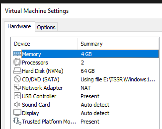
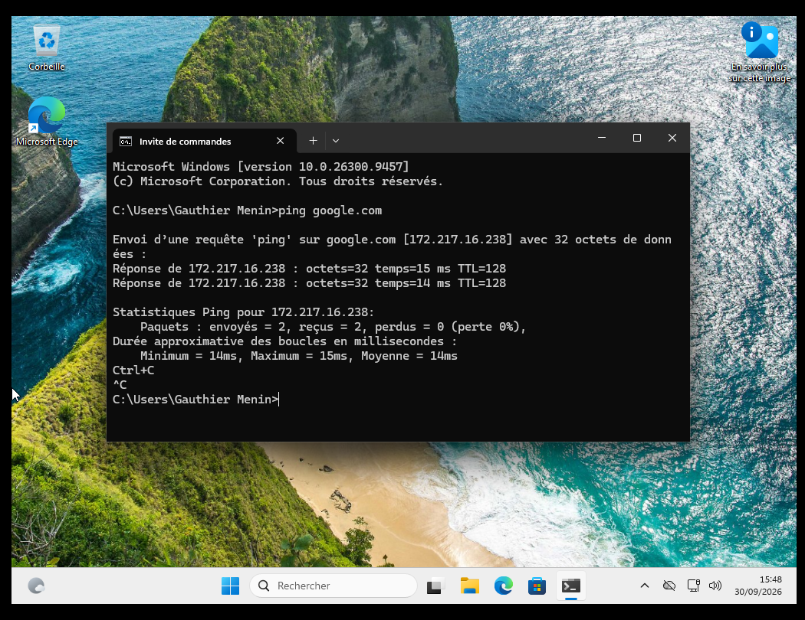

# TP 04 — Déploiement de CLI-WIN-MEN-01 sous VMware Workstation

**Semaine 2 — Systèmes et virtualisation** · Laboratoire TSSR · Travail individuel
**Date de déploiement :** 2026-09-30

---

## 1. Synthèse

Première brique du laboratoire TSSR : installation de VMware Workstation, rattachement au réseau NAT `LAB-TSSR` (VMnet8) et déploiement d'un poste client Windows 11 Professionnel conforme à la convention de nommage.

| Point | Statut |
|---|---|
| Hyperviseur installé | ✅ |
| Réseau NAT identifié (VMnet8) | ✅ |
| VM créée aux ressources imposées | ✅ |
| Windows 11 installé et à jour | ✅ |
| Périphériques sans erreur | ✅ |
| Accès Internet validé | ✅ |

---

## 2. Architecture cible du laboratoire

| Élément | Nom | Rôle | État |
|---|---|---|---|
| Poste Windows | `CLI-WIN-MEN-01` | Poste client | **Déployé** |
| Serveur Windows | `SRV-WIN-MEN-01` | Serveur Windows | À venir |
| Serveur Linux | `SRV-LIN-MEN-01` | Serveur Linux | À venir |
| Réseau logique | `LAB-TSSR` | Réseau du laboratoire | Défini |
| Réseau VMware | `VMnet8` | NAT avec accès Internet | Défini |

**Convention de nommage :** `[SRV|CLI]-[WIN|LIN]-[TRIGRAMME]-01` (type de machine, famille d'OS, trigramme apprenant, numéro d'ordre).

---

## 3. Prérequis vérifiés

| Élément | Valeur |
|---|---|
| Virtualisation matérielle (Gestionnaire des tâches › Performances › Processeur) | ✅|
| Produit | VMware Workstation |
| Version | VMware® Workstation Pro 26H1u1 |
| Répertoire des VM | C:\Users\Gauthier\Documents\Virtual Machines |
| ISO | Windows11_Client_x64_fr-fr_26300_9457.iso |

---

## 4. Réseau du laboratoire

| Élément | Valeur |
|---|---|
| Nom logique | `LAB-TSSR` |
| Réseau VMware | `VMnet8` |
| Mode | NAT |
| DHCP VMware actif | Ping réussi |
| Sous-réseau | Ping réussi |

En mode NAT, la VM accède à Internet via la connectivité de l'hôte sans être exposée comme une machine du réseau physique ; l'adressage est distribué par le service DHCP de VMware. Les trois VM du laboratoire partageront ce même réseau.

---

## 5. Configuration de la VM

| Paramètre | Valeur imposée | Valeur appliquée |
|---|---|---|
| Nom | `CLI-WIN-[TRIGRAMME]-01` | `CLI-WIN-MEN-01` |
| Système invité | Windows 11 | Windows 11 Pro  |
| vCPU | 2 | 2 |
| RAM | 4 Go | 4 Go |
| Disque virtuel | 64 Go | 64 Go |
| Réseau | VMnet8 (NAT) | VMnet8 (NAT) |
| Firmware | UEFI si proposé | UEFI |

Correspondance physique / virtuel : CPU → vCPU · RAM → RAM attribuée · SSD/HDD → disque virtuel · carte réseau → carte réseau virtuelle · BIOS/UEFI → firmware virtuel · clé USB d'installation → ISO montée.

---

## 6. Installation de Windows 11

1. Démarrage de la VM sur l'ISO Windows 11
2. Choix de la langue et du clavier
3. Sélection de l'édition **Professionnel**
4. Installation sur le disque virtuel de 64 Go
5. Redémarrages automatiques, puis OOBE
6. Création d'un compte local et ouverture de session

**Écarts avec la documentation de la semaine 1 :** _À compléter (écrans ou choix différents), ou « aucun »._

---

## 7. Finalisation du poste

- [x] Nom de la machine vérifié : `CLI-WIN-MEN-01`
- [x] Windows Update exécuté : système à jour
- [x] Gestionnaire de périphériques : aucun périphérique en erreur
- [x] Carte réseau virtuelle présente
- [x] Réseau en NAT, accès Internet testé

---

## 8. Fiche de configuration — poste Windows

| Élément | Valeur |
|---|---|
| Nom de la VM | `CLI-WIN-MEN-01` |
| Rôle | Poste client |
| Système | Windows 11 |
| Édition | Professionnel |
| Version | 26H2 |
| vCPU | 2 |
| RAM | 4 Go |
| Disque virtuel | 64 Go |
| Réseau logique | `LAB-TSSR` |
| Réseau VMware | `VMnet8` |
| Mode réseau | NAT |
| Compte utilisé | Compte local |
| Date d'installation | 2026-09-30 14 h 18 |
| État Windows Update | À jour |
| État périphériques | OK |
| Accès Internet testé | Oui |
| Remarques | RAS |

---

## 9. Captures d'écran

**9.1 — VMware Workstation, VM visible dans la bibliothèque**

**9.2 — Paramètres CPU / RAM**

**9.3 — Configuration réseau (NAT)**

**9.4 — Windows 11 démarré**

---

## 10. Critères de réussite

| Critère | Validé |
|---|---|
| VMware Workstation fonctionnel | ✅ |
| Virtualisation matérielle disponible | ✅ |
| Convention de nommage respectée | ✅ |
| VM sur réseau NAT | ✅ |
| Ressources conformes (2 vCPU / 4 Go / 64 Go) | ✅ |
| ISO Windows 11 utilisée | ✅ |
| Windows 11 démarre, poste correctement nommé | ✅ |
| Fiche de configuration complète | ✅ |
| Accès Internet fonctionnel | ✅ |